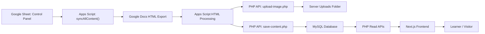
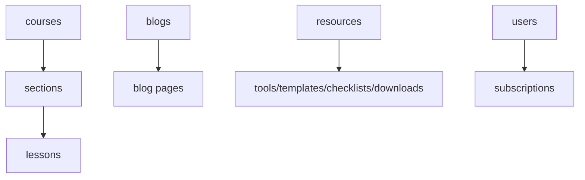
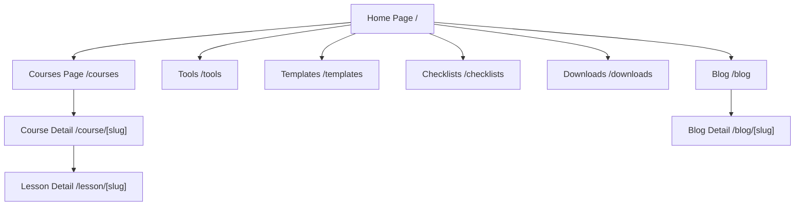

# Application Workflow

This document describes the current workflow of the application as implemented in this repository.

## 1. High-Level Workflow

## 2. Content Publishing Workflow

### Step 1: Content is managed in Google Workspace

- The content team prepares rows in the `Control Panel` Google Sheet.
- Each row defines:
  - `type`
  - `course_name`
  - `section_name`
  - `title`
  - `slug`
  - `source_id`
  - `access_type`
  - `order_no`
  - `status`
  - `category`
- Only rows with `status = "sync"` are processed.

### Step 2: Apps Script starts the sync

- `syncAllContent()` reads all rows from the sheet.
- For each row marked `sync`, it builds a payload for the backend.
- Supported content types are:
  - `course`
  - `lesson`
  - `blog`
  - `tool`
  - `template`
  - `checklist`
  - `download`

### Step 3: Google Docs content is exported and cleaned

- If a `source_id` exists, Apps Script exports the Google Doc as HTML.
- Then it processes the HTML in this order:
  1. `processImages(html, slug, type)`
  2. `detectYouTube(html)`
  3. `cleanHtmlTags(html)`

### Step 4: Images are uploaded to the server

- Apps Script finds image sources inside the exported HTML.
- If an image is base64 or from Google-hosted sources, it fetches the image.
- The image is converted to base64 and sent to `upload-image.php`.
- The PHP backend stores the file in `backend/uploads/<type>/<slug>/`.
- The original image URL in HTML is replaced with the uploaded server URL.

### Step 5: Clean content is saved into MySQL

- Apps Script sends JSON to `save-content.php`.
- The PHP backend performs insert-or-update behavior:
  - `course` -> saved in `courses`
  - `lesson` -> linked to `courses` through `sections`, then saved in `lessons`
  - `blog` -> saved in `blogs`
  - resource types -> saved in `resources`
- If sync succeeds, the sheet row status becomes `synced`.
- If sync fails, the sheet row status is updated with `error: ...`.

## 3. Backend Data Workflow

### Core tables

- `courses`
- `sections`
- `lessons`
- `blogs`
- `resources`
- `users`
- `subscriptions`

### Relationship flow

### Read APIs used by the frontend

- `get-courses.php` -> returns all courses
- `get-course.php?slug=...` -> returns one course with sections and lessons
- `get-lesson.php?slug=...` -> returns one lesson
- `get-blog.php` -> returns all blogs
- `get-blog.php?slug=...` -> returns one blog
- `get-resources.php?type=...` -> returns resources by type

## 4. Frontend User Workflow

### Visitor journey

### Home page workflow

- The home page calls `getCourses()`.
- It shows:
  - featured courses
  - category shortcuts
  - links to tools, templates, checklists, and downloads
  - CTA buttons for courses and tools

### Courses page workflow

- The courses page fetches all courses from `get-courses.php`.
- The visitor can:
  - search courses by name
  - filter by category
  - open a course detail page

### Course detail workflow

- The course page fetches one course by slug from `get-course.php`.
- It shows:
  - course metadata
  - thumbnail
  - section list
  - lesson list inside each section
- The `Start Learning` button opens the first lesson of the first section.

### Lesson page workflow

- The lesson page fetches one lesson by slug from `get-lesson.php`.
- If `access_type = free`:
  - the lesson HTML is rendered directly
- If `access_type = paid`:
  - the visitor sees a paywall card
  - the user is pushed toward `/register`

### Blog workflow

- `/blog` fetches the blog list from `get-blog.php`.
- `/blog/[slug]` fetches a single article from `get-blog.php?slug=...`.
- The article HTML is rendered directly in the page.

### Resource workflow

- `/tools` loads `tool` resources
- `/templates` loads `template` resources
- `/checklists` loads `checklist` resources
- `/downloads` loads `download` resources
- Resource cards open `file_url` in a new tab

## 5. Important Business Logic

### Access control

- Lessons support `free` and `paid` access types.
- Right now, access is enforced only at the UI level on the lesson page.
- There is no implemented JWT auth flow in this repository yet, even though the planning docs mention it.

### Rendering strategy

- The frontend uses server fetching for several pages and client fetching for `/courses`.
- API requests use `NEXT_PUBLIC_API_BASE` or fall back to `http://localhost/backend/api`.
- Lesson and blog HTML are rendered with `dangerouslySetInnerHTML`.

## 6. Current Gaps Between UI and Implementation

- `Login` and `Register` links exist in the navbar, but corresponding pages are not present in the frontend app.
- `users` and `subscriptions` tables exist, but no auth API is implemented in the backend files included here.
- Paid lesson restriction is presentation-based right now; the lesson API still returns full lesson data.
- Resource cards depend on `file_url`, but the current sync flow mainly stores `html_content` for resources unless `file_url` is provided separately.

## 7. Practical End-to-End Summary

1. Content is authored in Google Docs and controlled from Google Sheets.
2. Apps Script exports, cleans, and enriches the content.
3. Images are uploaded to the server and replaced inside the HTML.
4. PHP APIs store structured content in MySQL.
5. Next.js reads the stored data through PHP JSON endpoints.
6. Visitors browse courses, open lessons, read blogs, and access resources.
7. Premium lessons show a paywall, but full backend subscription enforcement is not yet implemented.
